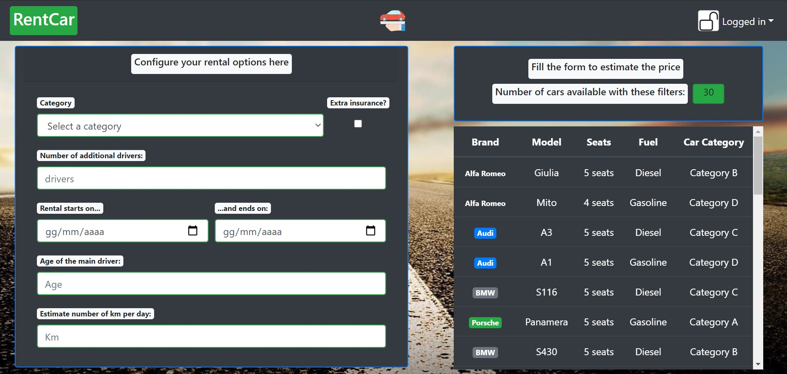
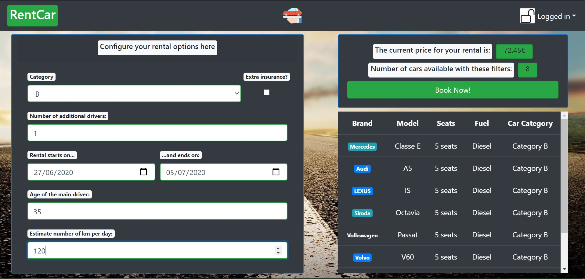

# Exam #1: "Noleggio veicoli"
## Student: s277483 ABBAMONTE MATTEO 

## React client application routes

- Route `/`:
  * public form with multiple category and brand filtering function;
  * public car table with the list of the resulting cars;
- Route `/public`:
  * same as above, this is the original page path. the previous one is obtained through a Redirect;
- Route `/configure`: 
  * rental configuration form on the left;
  * price dashboard on the top-right corner: it shows the price per day and the number of vehicles available according to the current solution; plus, it contains the button for booking with the current solution or an alert element if there are no cars available according to the same solution;
  * private car table with the list of the resulting cars in the bottom-right corner;
- Route `/payment`:
  * payment form in central position: it contains blank fields to compile with card and card holder informations; also, in the righmost area of the form there's a summary of the discounts and surcharges applied;
  * after the payment, a modal pops up with informations linked to the selected and rented car or, if the payment process encountered problems, an hint on re-entering payment data;
- Route `/history`: 
  * rental table on the left, containing informations linked to past rentals
  * rental table on the right, containing future or current rentals; future rentals can be deleted;
  * a modal pops up in case a future rental is selected do be deleted; the modal contains a request for a confirmation

## REST API server

- POST `/api/login`
  - no parameters
  - request body: email, password
  - response body: userID, userName
- POST `/api/logout`
  - no parameters
  - no request body
  - no response body
- GET `/api/cars`
  - query parameters: categories, brands
  - no request body
  - response body: list of cars according to the query parameters
- GET `/api/configure`
  - query parameters: category, period
  - no request body
  - response body: list of cars according to the query parameters
- GET `/api/rentals`
  - query parameters: extended (with cars brands and names or not)
  - no request body
  - response body: list of rentals related to the current user
- POST `/api/payment`
  - no query parameters
  - request body: payment object (card holder, card number, expiration date, cvv)
  - response body: confirmation
- POST `/api/record_rental`
  - no query parameters
  - request body: rental object (car category, start date, end date, price)
  - response body: confirmation
- DELETE `/api/delete`
  - no query parameters
  - request body: rental object (car category, start date, end date, price)
  - response body: confirmation
- POST `/api/authentication_control`
  - no query parameters
  - no request body
  - response body: confirmation

## Server database

- Table `car` - contains: id brand model category seats fuel price
- Table `rental` - contains: car_id user_id start_date end_date price
- Table `user` - contains: id email password name surname age

## Main React Components

- `ListOfSomething` (in `List.js`): component purpose and main functionality
- `GreatButton` (in `GreatButton.js`): component purpose and main functionality
- ...

(only _main_ components, minor ones may be skipped)

## Screenshot

#### Empty Configurator

#### Filled Configurator

## Test users

* username, password
* username, password
* username, password (frequent customer)
* username, password
* username, password (frequent customer)
